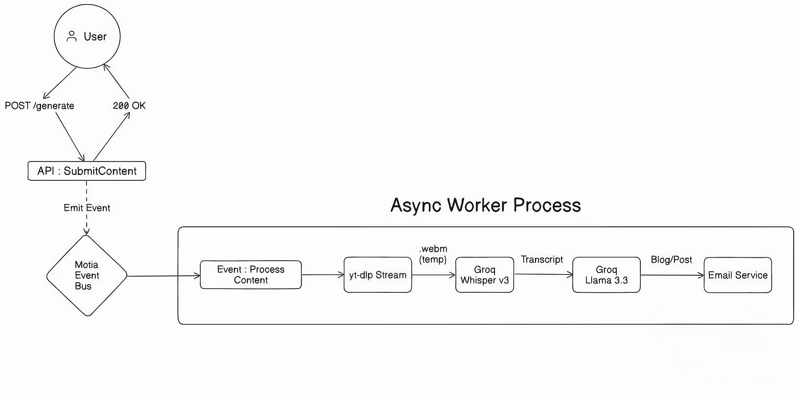

# 🚀 ContentForge

> **The Event-Driven AI Content Engine**  
> *Built for the Backend Reloaded Hackathon using [Motia](https://motia.dev).*

**ContentForge** automates the tedious process of content repurposing. It takes any YouTube video or Short and instantly transforms it into a Blog Post, LinkedIn Article, or Tweet using state-of-the-art AI.

Unlike traditional synchronous APIs that time out on large files, ContentForge uses **Motia's Event-Driven Architecture** to handle heavy media processing asynchronously, delivering production-grade reliability and zero-latency user feedback.

---

## 📋 Table of Contents

- [🚀 ContentForge](#-contentforge)
  - [📋 Table of Contents](#-table-of-contents)
  - [🏗️ Architecture](#️-architecture)
  - [✨ Key Features](#-key-features)
  - [🛠️ Tech Stack](#️-tech-stack)
  - [🚀 Getting Started](#-getting-started)
    - [1. Prerequisites](#1-prerequisites)
    - [2. Installation](#2-installation)
    - [3. Configuration (.env)](#3-configuration-env)
    - [4. Run the Backend](#4-run-the-backend)
  - [🧪 How to Test (The Demo Flow)](#-how-to-test-the-demo-flow)
  - [🤝 Open Source Contribution](#-open-source-contribution)
  - [👥 Team](#-team)
  - [📜 License](#-license)

---

## 🏗️ Architecture

ContentForge replaces a complex stack (Express + Redis + Worker + Python) with just **two Motia Steps**:



*The event-driven pipeline: The API (Left) responds instantly, while the Async Worker (Right) handles heavy AI processing.*

## ✨ Key Features

- **⚡ Zero-Latency API (Non-Blocking):** The API accepts the request and returns immediately. The heavy processing happens in the background, preventing HTTP timeouts.

- **🌊 Streaming I/O:** Uses `youtube-dl-exec` with stream pipelines to download audio directly to disk, keeping memory usage low even for long videos.

- **🛡️ Resilience by Default:**
  - **Auto-Cleanup:** Implements `try...finally` blocks to ensure temp files are deleted even if the server crashes.
  - **Smart Error Handling:** Distinguishes between Retriable Errors (Network blips) and Non-Retriable Errors (400 Bad Request), preventing infinite retry loops.

- **🧠 Advanced AI Pipeline:**
  - **Hearing:** `whisper-large-v3` for near-perfect transcription.
  - **Thinking:** `llama-3.3-70b-versatile` on Groq LPU for instant text generation.

## 🛠️ Tech Stack

- **Framework:** [Motia](https://motia.dev/) (Unified Backend Runtime)
- **AI Inference:** [Groq](https://groq.com/) (Llama 3.3 & Whisper)
- **Media Processing:** `yt-dlp` / `youtube-dl-exec`
- **Notifications:** `fastforwardit`
- **Language:** TypeScript

---

## 🚀 Getting Started

### 1. Prerequisites

- Node.js (v18 or v20 LTS recommended)
- A [Groq API Key](https://console.groq.com/keys) (Free)
- A Gmail account (App Password) for sending results

### 2. Installation

```bash
# Clone the repository
git clone https://github.com/yourusername/content-forge.git
cd content-forge

# Install dependencies
npm install
```

### 3. Configuration (.env)

Create a `.env` file in the root directory:

```env
# AI Configuration
GROQ_API_KEY=gsk_your_key_here

# Email Configuration (For sending results)
APP_MAIL=your-email@gmail.com
APP_PASS=your-gmail-app-password
```

### 4. Run the Backend

```bash
# Start the Motia development server
npm run dev
```

The server will start at `http://localhost:3000`. Open this URL to see the Motia Workbench and visualize the content-forge-flow.

---

## 🧪 How to Test (The Demo Flow)

1. **Open Workbench:** Go to `http://localhost:3000`

2. **Send a Request:** Use Postman, Curl, or the Workbench "Test" tab:

   ```bash
   POST http://localhost:3000/api/generate
   Content-Type: application/json
   
   {
     "url": "https://www.youtube.com/shorts/your-video-id",
     "to": "your-email@gmail.com",
     "purpose": "LinkedIn Post"
   }
   ```

3. **Watch the Magic:**
   - You will receive an immediate `200 OK` response
   - Look at the Workbench Logs to see the async worker waking up:
     - ⬇️ Downloading audio...
     - 📝 Transcribing...
     - 🧠 Generating content...
     - 📧 Sending email...

4. **Check Inbox:** You will receive a beautifully formatted HTML email with your AI-generated post!

---

## 🤝 Open Source Contribution

During the development of ContentForge, I identified a DX gap in the Motia Workbench where logical connections (`emit`/`subscribe`) were not being visualized without explicit configuration.

I raised an issue and submitted a PR to improve the documentation and starter templates, ensuring future developers don't face the same friction.

- **Issue-1:** [Link](https://github.com/MotiaDev/motia/issues/1102)
- **Issue-2:**
[Link](https://github.com/MotiaDev/motia/issues/1084)
- **PR:** [Link](https://github.com/MotiaDev/motia/pull/1086)

---

## 👥 Team

- **Saish Mungase** - Full Stack Developer & Architect

---

## 📜 License

This project is open-source and available under the [MIT License](LICENSE).

---